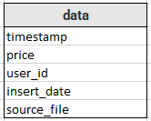
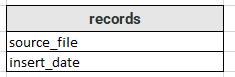

# Solución Prueba de ingeniería de datos Pragma
___

La presente solución plantea un pipeline para el cargue, limpieza y almacenamiento
de la información contenida en los archivos .csv en una base de datos 
mysql, haciendo uso del lenguaje de programación _Python_. La creación de la
base de datos, así como de las tablas usadas durante el proceso, son creadas
directamente en el script mediante la función _create_tables_database()_.

El flujo de trabajo de este proceso, es el siguiente:
1. Identificación de archivos: Inicialmente, se identifican los archivos
2012-*.csv y se almacenan sus nombres en un objeto tipo lista. Esto se hace 
   para restringir que en la primera parte del proceso, no sea cargada en base de 
   datos la información contenida en el archivo validation.csv
   

2. Cargue de datos: Una vez identificados los archivos a usar para alimentar 
la base de datos, se procede con la carga individual de cada uno de estos. Esto se hace 
   de la manera tradicional
   ~~~
   with open(file_name, mode='r') as csv_file:
   ~~~
   debido a que el tamaño de los archivos no es considerable. Luego de tener
los datos en memoria, recorremos una a una las filas del archivo y vamos actualizando
   en cada iteración los valores de la suma, maximo y mínimo del precio, así como
   la cantidad de registros con precio no nulo. Con base en esto, se calcula el promedio
   en cada iteración y se imprimen los valores actuales en pantalla.
   Esto se hace con el fin de cumplir con el requerimiento  
    
    
_<<<Se espera que en la ejecución de este pipeline al menos después de que se
cargue cada .CSV (pero idealmente después de la inserción de cada fila), estas
estadísticas se actualicen para reflejar los nuevos datos. Las actualizaciones
del pipeline NO deben tocar los datos ya cargados, es decir, hacer “SELECT avg
(price) ...” para cada actualización no es una buena solución al problema.>>>_
   

3. Luego, en cada una de las iteraciones mencionadas en el paso
anterior, se hace una inserción en base de datos con la información contenida
   en los archivos y adicionando los campos *source_file* que identifica el archivo
   de origen y el campo *insert_date*, para tener registro del momento en que se
   almacena la información. 
  
 
4. Una vez se tienen los registros de todos los archivos 2012-*.csv en base de datos,
se hacen varias consultas a la misma con el fin de obtener las "estadísticas" y compararlas con las
   calculadas y actualizadas durante todo el proceso.
  
 
5. Finalmente, al terminar los pasos anteriores, se vuelven a llevar a cabo tal cual, pero
esta vez con el archivo _validation.csv_
   

**Observaciones:**
- Durante todo el proceso, se hace uso de un logger para llevar registro de la 
ejecución del proceso. Este, guarda los detalles y errores (en caso de ocurrir alguno)
  en un archivo _**logfile**_ que se genera en el directorio actual de trabajo.
  
- El proceso tiene un time.sleep(0.2) en la lectura de cada línea de cada archivo. Esto no tiene
otro fin, más que permitir ver al usuario la actualización de las "estadísticas" en cada iteración.
 
 
- Antes de ejecutar el script **main.py**, por favor modifique los valores en el archivo _**.env**_, con el fin 
de configurar las credenciales de acceso a la base de datos de su entorno local. *MYSQL_DATABASE* se refiere al nombre
  de la base de datos que se creará para guardar los registros. Dentro de ella se crean las tablas *data* y *records*. Los
  esquemas de dichas tablas son los siguientes
  

 Variables a agregar en el archivo .env:
~~~
MYSQL_PASSWORD=example
MYSQL_USER=root
MYSQL_HOST=localhost
MYSQL_DATABASE=pragma
~~~