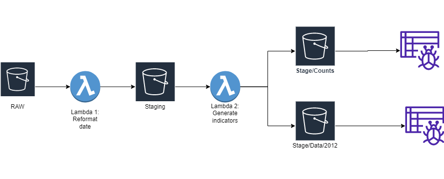
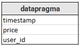
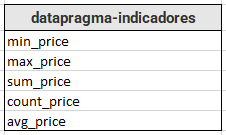

# Ejercicio de exploración de un solución basada en servicios de AWS.
___

Esta parte, es el resultado de una exploración de los servicios de aws en busca de una solución para el problema planteado. 
Esta hace uso de los recursos Buckets de S3, funciones Lambda y Crawlers de AWS Glue para generar un 
pipeline que satisfaga los requerimientos solicitados. Sin embargo, solo aborda la parte de carga y limpieza de los datos, así
como la generación de "estadísticas" de la información.

A pesar de que se vean varios buckets, en realidad solo usamos 2, pero los "distribuimos" de la siguiente manera:
- Bucket 1: _pruebapragma-data-raw-dev_
  ~~~
  └── RAW
  ~~~
- Bucket 2: _pruebapragma-data-stage-dev_
  ~~~
    ├── Staging  
    └── Stage  
        ├── Conteos  
                └── 2012-*.csv-indicators  
        └── Data  
            └── 2012  
                ├── 1  
                    └── 2012-1.csv  
                ...  
                └── 5  
                    └── 2012-5.csv  
  ~~~

Teniendo clara la estructura de almacenamiento, veamos cómo y en qué 
momento son estos espacios usados, detallando el flujo del proceso:

1. Se ejecuta el script _**put_data.py**_, el cual carga los archivos 
_2012-*.csv_ y _validation.csv_ en **RAW**.
   
2. Conectado a **RAW**, tenemos una función lambda (_**lambda1_clean_data.py**_)
encargada de reformatear el campo  **timestamp** y copiar los datos dentro
   de **Staging**.
   
3. Cuando los datos llegan a Staging, se dispara una segunda función lambda
   (_**lambda2_indicadores.py**_), la cual realiza dos tareas:
   -    Cargar el archivo en un dataframe de Pandas, calcular suma, máximo
    mínimo, y recuento del campo **timestamp**. Estos datos los guarda en un 
        archivo llamado _2012-*-indicators.csv_ y almacena este archivo en **Stage/Conteos.**
        
    -   Copia los archivos _2012-#.csv_ son en **Stage/Data/2012/#**
    
4. Conectados a **Stage/Data/2012** y **Stage/Conteos** hay unos Crawlers 
que, al ejecutarse, generan y alimentan tablas SQL que contienen la información
   de los .csv originales (**datapragma**) y los recuentos llevados a cabo
   durante la ejecución (**datapragma-indicadores**)
   
Las tablas resultantes del paso 4, siguen los siguientes esquemas:

     
   